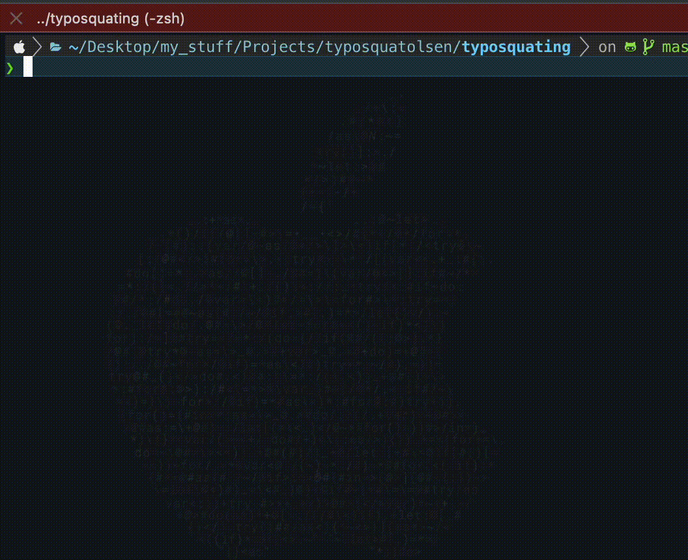

# Anti-Typosquatting

[](https://www.npmjs.com/package/anti-typosquatting)
[](https://github.com/your-username/anti-typosquatting/blob/main/LICENSE)

**A powerful npm package to prevent typosquatting attacks by catching npm install <package_name> typos.**



# Features

- 🕵️‍♀️ Detects potential typosquatting attempts in package names.
- 🧪 Provides suggestions for correct package names.
- ⚙️ Integrates seamlessly with your existing npm workflows.
- ⚡️ Lightweight and fast, averaging 10ms per package check.

# How to use
```bash
npi <package_name> # instals the package if it is safe, otherwise provides suggestions for the correct package name
npi --refresh # refreshes the list of top 10000 packages (useful if you want to force-update the list)
npi --distance <distance> # sets the tolerated distance for typosquatting detection (default is 2) # alternatively, you can set your env variable TYPOSQUATTING_TOLERATED_DISTANCE to the desired value
```

Every time you run `npi <package_name>`, anti-typosquatting will check if the package name is a potential typosquatting attempt. If it is, it will provide suggestions for the correct package name. If the package name is safe, the installation will proceed as normal.

# How it Works
Anti-typosquatting uses the [Levenshtein distance algorithm](https://en.wikipedia.org/wiki/Levenshtein_distance) to calculate the similarity between the package that the user wants to install against the top 10000 npm packages (retrieved from [LeoDog896's latest npm-rank release](https://github.com/LeoDog896/npm-rank)).

The Levenshtein distance between two strings is calculated by finding the minimum number of operations required to transform one string into the other (operations being insertions, deletions, or substitutions). This is a perfect way to detect typosquatting attempts, as it can detect small differences between two strings that are caused by typos or misspellings.

Levenshtein distance algorithm's dynamic programming implementation has a time complexity of O(m*n), where m and n are the lengths of the two strings being compared, so the algorithm is very fast and efficient. On average, the algorithm takes around 10ms to calculate the similarity between the package name and the top 10000 packages, making it a great choice for typosquatting detection.


## Installation

To install the package, run the following command:

```bash
npm install anti-typosquatting -g
```

Congrats! Running `npi <package_name>` will now check if the package name is a potential typosquatting attempt before installing the package.

Note: The packages typosquatting, typosquating, and safe-install are all owned by me too so you can install those as well :)

(OPTIONAL)
If you'd like to use `npm install` instead of the `npi` command, you can set up an alias.

To set up the alias, use the alias-setup.sh script (make sure to double check your bash config file path):

```bash
./src/alias-setup.sh
```

(You can still use the npm install without going through the checking if you use npm oldinstall <package_name> after using the alias-setup.sh script)

You can edit how aggressive the typosquatting detection is by adding an env variable called `TYPOSQUATTING_TOLERATED_DISTANCE`. The threshold is the maximum Levenshtein distance between the package name and the top 10000 packages that is considered safe. By default, the threshold is set to 2, but you can change it to any value you like. Higher, the value, the more aggressive the detection will be.


## Contributing
Contributions are welcome! Feel free to submit issues or pull requests to improve the library.

## License
anti-typosquatting is MIT licensed.

